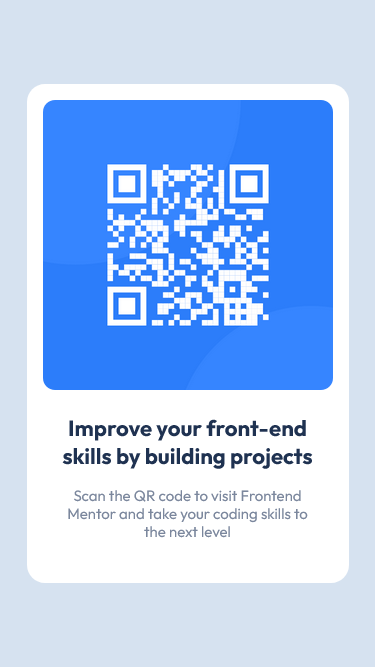
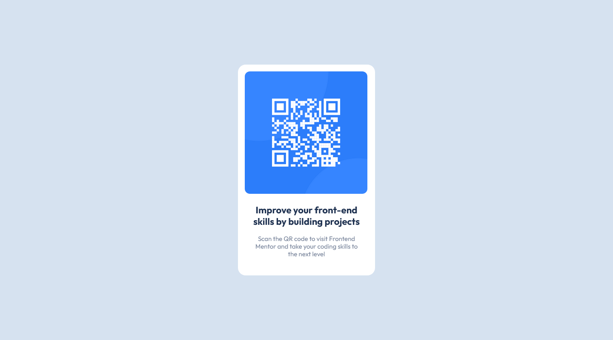

# Frontend Mentor - QR code component solution

This is a solution to the [QR code component challenge on Frontend Mentor](https://www.frontendmentor.io/challenges/qr-code-component-iux_sIO_H). Frontend Mentor challenges help you improve your coding skills by building realistic projects. 

## Table of contents

- [Overview](#overview)
  - [Screenshot](#screenshot)
  - [Links](#links)
- [My process](#my-process)
  - [Built with](#built-with)
- [Author](#author)

## Overview

### Screenshot

#### Mobile Result

#### Desktop Result

### Links

- Solution URL: [Add solution URL here](https://your-solution-url.com)
- Live Site URL: [Add live site URL here](https://your-live-site-url.com)

## My process

### Built with

- Semantic HTML5 markup
- CSS custom properties
- Flexbox Layout
- Mobile-first workflow
- Rwd(Responsive Web Design)
- [React](https://reactjs.org/) - JS library
- Normalize CSS - [Normalize](https://necolas.github.io/normalize.css/) - Reset CSS
- Methodology BEM(Block Element Modifier) - [BEM](http://getbem.com/introduction/) - Methodology

### Getting Started with Create React App

This project was bootstrapped with [Create React App](https://github.com/facebook/create-react-app).

#### Available Scripts

In the project directory, you can run:

#### `npm start`

Runs the app in the development mode.\ 
Open [http://localhost:3000](http://localhost:3000) to view it in your browser.

The page will reload when you make changes.\
You may also see any lint errors in the console.

#### `npm test`

Launches the test runner in the interactive watch mode.\
See the section about [running tests](https://facebook.github.io/create-react-app/docs/running-tests) for more information.

#### `npm run build`

Builds the app for production to the `build` folder.\
It correctly bundles React in production mode and optimizes the build for the best performance.

The build is minified and the filenames include the hashes.\
Your app is ready to be deployed!

## Author

- Website - [Portefólio Samuel Amaro](https://samuel-amaro.github.io/portefolio-website/)
- Frontend Mentor - [@Samuel-Amaro](https://www.frontendmentor.io/profile/Samuel-Amaro)

